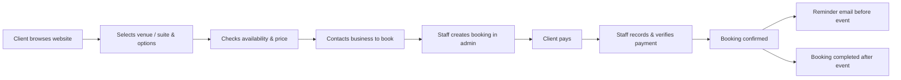

# Icon Venue & Suites — User Guide

This guide explains how the booking system works for **clients**, **staff**, and **administrators**. It focuses on everyday workflows — browsing, booking, payments, and reports — not technical setup.

---

## Who Uses This System?

| Role | Who they are | What they do |
|------|----------------|--------------|
| **Client** | Anyone visiting the public website | Browse venues and suites, check availability, get price estimates, and contact the business to book |
| **Staff** | Front-desk or operations team | Create bookings, record payments, verify payments, manage clients |
| **Admin** | Business owner or manager | Everything staff can do, plus venues, suites, packages, add-ons, staff accounts, settings, and reports |

**Staff and admin** log in at `/login`. **Clients** use the public website — no account is required.

---

## High-Level Overview

---

## Part 1 — Client Flow (Public Website)

### 1. Browse venues and suites

From the homepage you can:

- View the **carousel** and featured spaces
- Open **Venues** for event spaces (weddings, parties, corporate events, etc.)
- Open **Suites** for overnight stays
- Visit the **Contact** page for phone, email, WhatsApp, and social links

### 2. View details and pricing

On a venue or suite detail page you will see:

- Photos, description, capacity, and amenities
- **Pricing options** (for venues):
  - **Full Day** — separate full-day rate
  - **Morning** (8:00 AM – 12:00 PM)
  - **Afternoon** (1:00 PM – 5:00 PM)
  - **Evening** (6:00 PM – 10:00 PM)
  - **Event packages** (e.g. Birthday, Wedding) if configured
- **Add-ons** (catering, decorations, equipment, etc.) with optional stock limits

> **Note:** Full day price and time-slot prices are set independently. Selecting all three time slots uses the full-day rate, not the sum of the slots.

### 3. Choose a booking option

On the venue page:

1. Pick a **date** on the calendar (available dates are shown in green)
2. Select **Full Day**, individual **time slots**, or an **event package**
3. Optionally add **add-ons** and quantities
4. Review the **price summary** at the bottom

**Time slot rules:**

- You can select multiple slots (e.g. Morning + Afternoon)
- Selecting all three slots converts to **Full Day** pricing
- **Morning + Evening** cannot be combined (afternoon must be included for that pattern)

### 4. Check availability

Click **Check Availability** to confirm your selected date and option are still free before contacting the business.

### 5. Contact to book

Clients do **not** complete payment on the website. To proceed:

- Click **Contact to Book**
- Reach out via **phone**, **email**, **WhatsApp**, **Messenger**, or the **online booking form** (if configured)

The contact message can include your selected option and estimated total so staff can process the request quickly.

### 6. After you contact the business

Staff will:

1. Create the official booking in the admin panel
2. Send you a **booking reference** (e.g. `IVS-2026-XXXX`)
3. Guide you through payment
4. Confirm the booking once payment is verified

You may receive **email updates** when your booking status or payment status changes, and a **reminder email** about 24 hours before your event.

---

## Part 2 — Staff Flow (Admin Panel)

Staff log in and use the left sidebar for daily operations.

### Dashboard

Shows a quick overview of bookings, revenue, and recent activity.

### Create a booking

**Path:** New Booking (or Book from a venue listing)

1. **Select venue or suite**
   - Filter by Venues, Suites, or All
   - For **venues**: choose Full Day or specific time slots (and optional package)
   - For **suites**: standard stay is check-in 2:00 PM, check-out 12:00 PM next day; set number of days if needed
2. **Enter client details** — name, email, phone
3. **Set booking date** and duration
4. **Add add-ons** if applicable
5. **Apply discount** (optional) — amount or percentage with reason
6. **Review total** and submit

**After creation:**

- Booking status starts as **Pending**
- Payment status starts as **Unpaid**
- A unique **booking reference** is generated automatically
- Client may receive a booking confirmation email

### Manage bookings

**Path:** Bookings

| Action | When to use |
|--------|-------------|
| **View** | See full booking details, payments, and reference |
| **Edit** | Change date, slots, client info, or amounts (before/during coordination) |
| **Confirm** | Manually confirm when appropriate |
| **Cancel** | Client cancels or event is called off |
| **Complete** | Event or stay has finished |

**Calendar view** shows all bookings on a timeline. You can export calendar data to CSV.

### Record a payment

**Path:** Booking detail → Add Payment, or Payments → from booking list

1. Choose **Full Payment** or **Partial Payment**
   - **Full Payment** — pays the remaining balance; auto-verified for walk-in/cash scenarios
   - **Partial Payment** — custom amount; stays **Pending** until verified
2. Enter **amount**, **payment method**, and **reference number** (transaction ID, receipt no., etc.)
3. Optionally upload **proof of payment** (screenshot or receipt image)
4. Add **notes** if needed

### Verify or reject a payment

**Path:** Payments, or Payment Records on the booking page

**Before verifying**, review:

- Payment amount
- Payment method
- **Reference number** (shown on screen)
- Proof image (if uploaded)

| Status | Meaning |
|--------|---------|
| **Pending** | Recorded but not yet approved |
| **Verified** | Payment accepted; counts toward booking balance |
| **Rejected** | Payment declined (reason stored in notes); can be deleted |

**Verify** when the payment is confirmed in your bank, GCash, or other channel.

**Reject** if the proof is invalid or amount does not match — add a clear reason; the client may be notified by email.

When **verified payments** cover the full booking amount:

- Payment status → **Paid**
- Booking status → **Confirmed**

Partial verified payments set payment status to **Partial** until the balance is cleared.

### Manage clients

**Path:** Clients

- View all clients grouped by email
- See their booking history and contact details
- Update client information

### Browse venues & suites (staff)

Staff can toggle **availability** (active/inactive) for venues, suites, and packages without editing full venue settings.

---

## Part 3 — Admin Flow (Additional Features)

Admins have access to everything staff has, plus:

### Venues & suites

- Create and edit venues and suites (name, capacity, description, images, amenities)
- Set **Full Day Price** and **time-slot prices** separately
- Manage **event packages** per venue (pricing, inclusions, time-based package rates)
- Toggle availability

### Add-ons

- Create add-ons linked to venues (price, description, stock tracking)
- Enable or disable add-ons

### Staff accounts

- Add staff users with login credentials
- Activate or deactivate accounts

### Settings

- Business contact info (phone, email, WhatsApp, social links, booking form URL)
- Information shown on the public contact page and booking messages

### Carousel

- Manage homepage slideshow images

### Reports

**Path:** Reports

- Filter by **date range**
- View booking statistics, revenue, top venues/suites, and payment records
- **Export to Excel** (CSV) — includes booking details, amounts, payment methods, and **reference numbers**

---

## Booking & Payment Status Reference

### Booking status

| Status | Meaning |
|--------|---------|
| **Pending** | Booking created; awaiting full payment or confirmation |
| **Confirmed** | Fully paid (or manually confirmed) |
| **Cancelled** | Booking cancelled |
| **Completed** | Event or stay has ended |

### Payment status

| Status | Meaning |
|--------|---------|
| **Unpaid** | No verified payments yet |
| **Partial** | Some payment verified; balance remains |
| **Paid** | Full amount verified |

---

## Typical End-to-End Example

### Venue event (wedding)

1. **Client** browses venues → selects Full Day + add-ons → checks availability → contacts via WhatsApp
2. **Staff** creates booking with client details, wedding package, and add-ons
3. **Client** sends down payment via GCash
4. **Staff** records partial payment with reference number → verifies after checking account
5. **Client** pays balance before the event
6. **Staff** records and verifies final payment → booking becomes **Confirmed**
7. System sends **reminder email** 24 hours before the date
8. After the event, staff marks booking **Completed**

### Suite overnight stay

1. **Client** views suite → selects dates → contacts the business
2. **Staff** creates suite booking (multi-day if needed)
3. **Staff** records full payment (cash walk-in) → auto-verified
4. Booking is **Confirmed** immediately
5. After check-out, staff marks **Completed**

---

## Email Notifications

Clients may receive emails for:

- New or updated **booking status**
- **Payment verified** or **payment rejected**
- **Booking reminder** (about 24 hours before the event)

Ensure client email addresses are correct when creating bookings.

---

## Quick Tips

**For clients**

- Use the calendar on the venue page to avoid unavailable dates
- Keep your **booking reference** handy when paying or following up
- Send payment proof with the same reference number staff will record

**For staff**

- Always enter the **reference number** when recording payments — it appears before verification and in exported reports
- Use **Full Payment** for on-the-spot cash settlements
- Use **Partial Payment** for installments; verify each one separately
- Check the Payments list daily for pending items

**For admins**

- Set full-day and time-slot prices independently when editing venues
- Review **Reports** monthly and export to Excel for accounting
- Keep contact settings and carousel images up to date on the public site

---

## Getting Help

- **Public website:** Use the Contact page for business inquiries
- **Admin panel:** Contact your system administrator for login or access issues
- **Technical setup:** See [README.md](README.md) for installation and developer documentation

---

*Icon Venue & Suites Booking System — User Guide*
